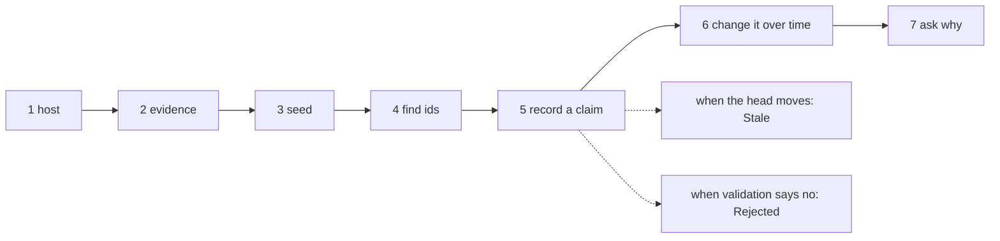
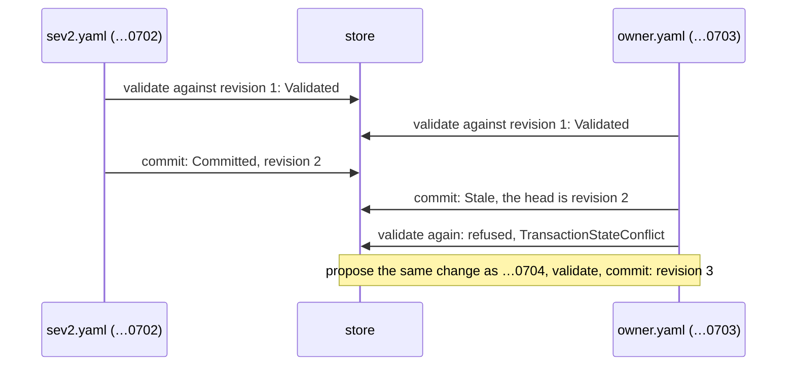
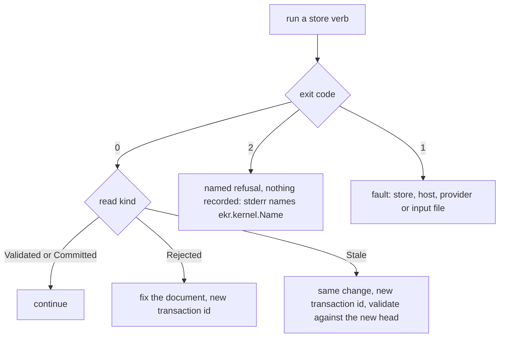

# The `ekr` guide: from an empty directory to an explained assertion

This guide builds a small store step by step. It records an operations incident, changes a claim
about it over time, asks why the store believes something, and handles each kind of failure. It is
task-oriented: each section is one thing you want to do. [The CLI reference](cli.md) has every
field and refusal, and [How EKR works](overview.md) explains the concepts behind the steps.

Every command on this page was run in order against a fresh store with the released `ekr 0.0.5`
binary, and the `--evidence` seed in step 3 with `ekr 0.0.6`. Every file shown is exactly the file that was run. Outputs are real, trimmed to the fields
that matter (`…` marks a cut), and hashes and timestamps will differ in your run. The
[schema evolution](schema-evolution.md) page continues with the same store.

The transaction documents on this page are `ekr.transaction-document/1`, the format those runs
used. 0.0.7 still reads them, under their own limits of 256 operations and 262144 bytes. Write new
documents as `ekr.transaction-document/2` (`ekr example transaction`): the same fields, up to 10,000
operations in 8 MiB ([document limits](cli.md#document-limits)).



## The domain

A service catalogue that tracks incidents:

| kind | name | why |
|---|---|---|
| node type | `Service` | properties `tier` (an `Enum`, required) and `owner_team` (a `String`) |
| node type | `Incident` | a lifecycle `open` → `mitigated` → `resolved`, moved only by the operations `mitigate` and `resolve`; properties `summary` (required) and `severity` (an `Enum`) |
| edge type | `AFFECTS` | from an `Incident` to a `Service` |
| assertion | "incident X affects checkout-api" | a claim someone made, so it cites evidence and has a valid time |
| assertion | "the severity was sev2, then sev1" | a claim that changes over time, so it is an assertion and not a property value |

The ids are written by hand so they are easy to follow: `…0011` is the operator, `…01xx` are types,
`…02xx` properties, `…03xx` nodes, `…04xx` evidence, `…05xx` assertions, `…06xx` edges and `…07xx`
transactions. In your own store, take every new id from `ekr mint`.

## 1. Write a host document

The host document names the tenant, the operator (who proposes and commits) and the validator (who
validates). The two must be different agents. Mint an id for each:

```shell-session
$ ekr mint agent
{
  "id": "01a0dde1-9481-7345-a006-81d5d962115a",
  "kind": "agent"
}
```

This host uses **validation profile v2** (`ekr.p2-deterministic/1` with `ekr.p2-apply/1`), so the
schema can grow later. Profile v1, the one `ekr example ekr.cli-host/1` prints, fixes the schema at
seeding. A store keeps the profile it was seeded under.

```json
{
  "format": "ekr.cli-host/1",
  "tenant": "operations",
  "context": {
    "operator": "00000000-0000-4000-c000-000000000011",
    "validator": "00000000-0000-4000-c000-000000000012"
  },
  "authority": {
    "format": "ekr.authority-state/1",
    "agents": {
      "00000000-0000-4000-c000-000000000011": {
        "id": "00000000-0000-4000-c000-000000000011",
        "name": "Operations operator",
        "capabilities": ["propose", "read"]
      },
      "00000000-0000-4000-c000-000000000012": {
        "id": "00000000-0000-4000-c000-000000000012",
        "name": "Operations validator",
        "capabilities": ["validate"]
      }
    },
    "validation_profile": {
      "format": "ekr.p1-validation-profile/1",
      "ruleset": "ekr.p2-deterministic/1",
      "checks": ["Structural", "Reference", "Type", "Cardinality", "OntologyConstraint", "Provenance", "Authorization"],
      "validator": "00000000-0000-4000-c000-000000000012",
      "proposer_separation": "distinct-authenticated-actor/1",
      "provenance": "retained-admissible-evidence/1",
      "application": "ekr.p2-apply/1"
    }
  }
}
```

Save it as `host.json` and point every store verb at it:

```bash
export EKR_HOST=host.json EKR_STORE=./ops-store EKR_BACKEND=file
```

Before the seed there is no store, and a read says so with exit 1:

```shell-session
$ ekr head
ekr: store-not-found: no file store at ./ops-store; `ekr seed` creates one
```

## 2. Prepare the evidence

Evidence enters **only through the seed**. Every assertion you will make must cite
evidence that is already in the store, so write the statements down before seeding. Put each one in
a file:

```text
On-call log: the checkout latency incident of 2026-07-14 affects checkout-api.
```

```text
Incident review: severity was sev2 from 09:00 UTC on 2026-07-14.
```

```text
Incident review: severity was raised to sev1 at 10:30 UTC on 2026-07-14.
```

These are `affects.txt`, `sev2.txt` and `sev1.txt`. Each ends with a newline, and the hash covers
it. `ekr hash` gives the content hash and the bytes in the form the seed needs:

```shell-session
$ ekr hash affects.txt
{
  "algorithm": "sha256(\"ekr.payload.v1\" || bytes)",
  "byte_len": 79,
  "content_hash": "9388269e08c65e3bc02106bf2f77115608faa7bd724db529651f79bb074acd69",
  "payload_yaml": "[79, 110, 45, 99, 97, 108, 108, 32, 108, 111, 103, 58, …, 97, 112, 105, 46, 10]"
}
```

`sev2.txt` hashes to `869f7f87…62c1ac` and `sev1.txt` to `732bd833…a899`. Put each
`content_hash` into an evidence entry. The bytes then reach the seed one of two ways: paste each
`payload_yaml` into `evidence_payloads`, as the `seed.yaml` below does, or, since 0.0.6, leave
`evidence_payloads: {}` and pass the files to `ekr seed --evidence` (step 3).

## 3. Seed the store

The seed holds the first schema version, the initial graph (two services and the incident, in its
lifecycle's `initial` state `open`) and the three evidence entries with their bytes. This is
`seed.yaml`:

```yaml
format: ekr-seed/2
ontology:
  version:
    id: 00000000-0000-4000-c000-000000000001
    number: 0
    parent: null
    created_at: 0
  node_types:
  - id: 00000000-0000-4000-c000-000000000101
    name: Service
    parents: []
    properties:
      00000000-0000-4000-c000-000000000201:
        id: 00000000-0000-4000-c000-000000000201
        name: tier
        value_type:
          value_kind: Enum
          parameters:
            variants: [critical, standard]
        cardinality: One
        required: true
        constraints: []
      00000000-0000-4000-c000-000000000202:
        id: 00000000-0000-4000-c000-000000000202
        name: owner_team
        value_type:
          value_kind: String
    abstract_type: false
    lifecycle: null
    operations: {}
  - id: 00000000-0000-4000-c000-000000000102
    name: Incident
    parents: []
    properties:
      00000000-0000-4000-c000-000000000203:
        id: 00000000-0000-4000-c000-000000000203
        name: severity
        value_type:
          value_kind: Enum
          parameters:
            variants: [sev1, sev2, sev3]
      00000000-0000-4000-c000-000000000204:
        id: 00000000-0000-4000-c000-000000000204
        name: summary
        value_type:
          value_kind: String
        required: true
    abstract_type: false
    lifecycle:
      initial: open
      states: [open, mitigated, resolved]
      transitions:
      - {from: open, to: mitigated}
      - {from: mitigated, to: resolved}
    operations:
      mitigate:
        name: mitigate
        arguments: {}
        preconditions: []
        transition: {from: open, to: mitigated}
        emits: []
      resolve:
        name: resolve
        arguments: {}
        preconditions: []
        transition: {from: mitigated, to: resolved}
        emits: []
  edge_types:
  - id: 00000000-0000-4000-c000-000000000103
    name: AFFECTS
    source_types: [00000000-0000-4000-c000-000000000102]
    target_types: [00000000-0000-4000-c000-000000000101]
    cardinality: Many
    properties: {}
    inverse: null
    symmetric: false
    transitive: false
graph:
  format: ekr.graph-document/2
  graph:
    root:
      id: 00000000-0000-4000-c000-000000000002
      space: Canonical
      schema_version_id: 00000000-0000-4000-c000-000000000001
      parent: null
      created_at: 0
    revision: 0
    nodes:
      00000000-0000-4000-c000-000000000301:
        id: 00000000-0000-4000-c000-000000000301
        root_id: 00000000-0000-4000-c000-000000000002
        type_id: 00000000-0000-4000-c000-000000000101
        canonical_name: checkout-api
        aliases: []
        type_state: null
        properties:
          00000000-0000-4000-c000-000000000201:
          - {value_kind: Enum, value: critical}
          00000000-0000-4000-c000-000000000202:
          - {value_kind: String, value: payments}
      00000000-0000-4000-c000-000000000302:
        id: 00000000-0000-4000-c000-000000000302
        root_id: 00000000-0000-4000-c000-000000000002
        type_id: 00000000-0000-4000-c000-000000000101
        canonical_name: search-api
        aliases: []
        type_state: null
        properties:
          00000000-0000-4000-c000-000000000201:
          - {value_kind: Enum, value: standard}
      00000000-0000-4000-c000-000000000303:
        id: 00000000-0000-4000-c000-000000000303
        root_id: 00000000-0000-4000-c000-000000000002
        type_id: 00000000-0000-4000-c000-000000000102
        canonical_name: Checkout latency, 2026-07-14
        aliases: []
        type_state: open
        properties:
          00000000-0000-4000-c000-000000000204:
          - {value_kind: String, value: p99 checkout latency above 2 s}
    edges: {}
    assertions: {}
    evidence:
      00000000-0000-4000-c000-000000000401:
        id: 00000000-0000-4000-c000-000000000401
        source: !HumanStatement
          identity: On-call log
        content_hash: 9388269e08c65e3bc02106bf2f77115608faa7bd724db529651f79bb074acd69
        extracted_by: 00000000-0000-4000-c000-000000000011
        observed_at: 1784030400000
        confidence: 10000
      00000000-0000-4000-c000-000000000402:
        id: 00000000-0000-4000-c000-000000000402
        source: !HumanStatement
          identity: Incident review notes
        content_hash: 869f7f871e4c84bd4a8b8ef5fd78ff97588e865d1b18b48443052ed79562c1ac
        extracted_by: 00000000-0000-4000-c000-000000000011
        observed_at: 1784073600000
        confidence: 9000
      00000000-0000-4000-c000-000000000403:
        id: 00000000-0000-4000-c000-000000000403
        source: !HumanStatement
          identity: Incident review notes
        content_hash: 732bd8338f5f8fd07b5d6fddbde6aebc3b225b9fcf35f72236a08d24fc59a899
        extracted_by: 00000000-0000-4000-c000-000000000011
        observed_at: 1784073600000
        confidence: 9000
evidence_payloads:
  9388269e08c65e3bc02106bf2f77115608faa7bd724db529651f79bb074acd69: [79, 110, 45, 99, 97, 108, 108, 32, 108, 111, 103, 58, 32, 116, 104, 101, 32, 99, 104, 101, 99, 107, 111, 117, 116, 32, 108, 97, 116, 101, 110, 99, 121, 32, 105, 110, 99, 105, 100, 101, 110, 116, 32, 111, 102, 32, 50, 48, 50, 54, 45, 48, 55, 45, 49, 52, 32, 97, 102, 102, 101, 99, 116, 115, 32, 99, 104, 101, 99, 107, 111, 117, 116, 45, 97, 112, 105, 46, 10]
  869f7f871e4c84bd4a8b8ef5fd78ff97588e865d1b18b48443052ed79562c1ac: [73, 110, 99, 105, 100, 101, 110, 116, 32, 114, 101, 118, 105, 101, 119, 58, 32, 115, 101, 118, 101, 114, 105, 116, 121, 32, 119, 97, 115, 32, 115, 101, 118, 50, 32, 102, 114, 111, 109, 32, 48, 57, 58, 48, 48, 32, 85, 84, 67, 32, 111, 110, 32, 50, 48, 50, 54, 45, 48, 55, 45, 49, 52, 46, 10]
  732bd8338f5f8fd07b5d6fddbde6aebc3b225b9fcf35f72236a08d24fc59a899: [73, 110, 99, 105, 100, 101, 110, 116, 32, 114, 101, 118, 105, 101, 119, 58, 32, 115, 101, 118, 101, 114, 105, 116, 121, 32, 119, 97, 115, 32, 114, 97, 105, 115, 101, 100, 32, 116, 111, 32, 115, 101, 118, 49, 32, 97, 116, 32, 49, 48, 58, 51, 48, 32, 85, 84, 67, 32, 111, 110, 32, 50, 48, 50, 54, 45, 48, 55, 45, 49, 52, 46, 10]
```

Times are milliseconds since the Unix epoch, UTC: `1784019600000` is 2026-07-14 09:00 UTC.

```shell-session
$ ekr seed seed.yaml
{
  "format": "ekr.seed-result/1",
  "result": {
    "agent_root": "2f078c28d7524d4bcc0c9d1ca3b5b95350e4493e0e38b09a63b2ffa153d6b2ce",
    "evidence_root": "a72fe289497c9d984abc9b0eb41960f74f8bf2afdf967b15d0dd92b2b7ac406b",
    "knowledge_root": "02bdaeba5ed49d4e3b35b3d8c455d2f0bd9d5f89bedda5a571f8ecc44f486a65",
    "ontology_root": "4209fcddb5c5d13cfdf7aa93c765e1ce332514dd122225daaddd0a032b1f3527",
    "parent": null,
    "revision": 0,
    …
  },
  "result_hash": "1566ba542cca052756e1363231d8055662bfd858645ce5f9c6b60ac007f21aef",
  …
}
```

With `evidence_payloads: {}` in place of the three pasted lists, pass the payload files instead.
The kernel sees the same document, so the seed has the same `evidence_root`:

```shell-session
$ ekr seed seed-files.yaml --evidence affects.txt --evidence sev2.txt --evidence sev1.txt
{
  "format": "ekr.seed-result/1",
  "result": {
    "evidence_root": "a72fe289497c9d984abc9b0eb41960f74f8bf2afdf967b15d0dd92b2b7ac406b",
    "revision": 0,
    …
  },
  …
}
```

Seeding is idempotent. The same file again prints the same result, with the same `committed_at`,
and writes nothing. A different seed on a seeded store is refused:

```shell-session
$ ekr seed seed-changed.yaml
ekr: ekr.kernel.AlreadySeeded: the lineage is already seeded
```

## 4. Find the ids you will use

A transaction refers to types, properties and nodes by id. `ekr ontology` gives the schema's ids and
names side by side, and `ekr snapshot` gives the graph's:

```shell-session
$ ekr ontology
{
  "edge_types": [
    {
      "cardinality": "Many",
      "id": "00000000-0000-4000-c000-000000000103",
      "name": "AFFECTS",
      "source_types": [{"id": "00000000-0000-4000-c000-000000000102", "name": "Incident"}],
      "target_types": [{"id": "00000000-0000-4000-c000-000000000101", "name": "Service"}],
      …
    }
  ],
  "node_types": [
    {"id": "00000000-0000-4000-c000-000000000101", "name": "Service", "properties": [{"id": "…0201", "name": "tier", "required": true, …}, {"id": "…0202", "name": "owner_team", …}], …},
    {"id": "00000000-0000-4000-c000-000000000102", "name": "Incident", "properties": [{"id": "…0203", "name": "severity", …}, {"id": "…0204", "name": "summary", "required": true, …}], …}
  ],
  "revision": 0,
  "schema_version": "00000000-0000-4000-c000-000000000001",
  "schema_version_number": 0,
  "schema_version_parent": null
}
```

`ekr ontology` does not print a type's lifecycle or its operations. The seed you wrote is where to
look them up.

## 5. Record a claim

"The incident affects checkout-api" is an assertion: a `!Relation` of the `AFFECTS` edge type,
citing the on-call log, true from 09:00. The same transaction adds the structural `AFFECTS` edge,
so a reader of the graph's edges sees the relation too. The transaction's own `evidence` lists
exactly the evidence its assertions cite. This is `affects.yaml`:

```yaml
format: ekr.transaction-document/1
transaction:
  id: 00000000-0000-4000-c000-000000000701
  proposer: 00000000-0000-4000-c000-000000000011
  operations:
  - !AddAssertion
    id: 00000000-0000-4000-c000-000000000501
    root_id: 00000000-0000-4000-c000-000000000002
    subject: !Node 00000000-0000-4000-c000-000000000303
    predicate: !Relation 00000000-0000-4000-c000-000000000103
    object: !Node 00000000-0000-4000-c000-000000000301
    evidence: [00000000-0000-4000-c000-000000000401]
    proposed_by: 00000000-0000-4000-c000-000000000011
    assessment: Proposed
    lifecycle: Active
    valid_time: {from: 1784019600000, to: null}
    transaction_time: {recorded_from: 0, recorded_to: null}
  - !CreateEdge
    id: 00000000-0000-4000-c000-000000000601
    root_id: 00000000-0000-4000-c000-000000000002
    type_id: 00000000-0000-4000-c000-000000000103
    source: 00000000-0000-4000-c000-000000000303
    target: 00000000-0000-4000-c000-000000000301
    properties: {}
  evidence: [00000000-0000-4000-c000-000000000401]
```

Then run the three steps. Each prints one JSON document; `kind` is the field to read.

```shell-session
$ ekr propose affects.yaml
{
  "format": "ekr.proposal-record/1",
  "operation_count": 2,
  "submitter": "00000000-0000-4000-c000-000000000011",
  "transaction_id": "00000000-0000-4000-c000-000000000701",
  "document_bytes": "Zm9ybWF0OiBla3IudHJhbnNhY3Rpb24tZG9jdW1lbnQvMQp0cmFu…",
  …
}
$ ekr transactions
[
  {
    "operation_count": 2,
    "proposer": "00000000-0000-4000-c000-000000000011",
    "state": "Proposed",
    "submitted_at": 1790428943724,
    "transaction_id": "00000000-0000-4000-c000-000000000701"
  }
]
$ ekr validate 00000000-0000-4000-c000-000000000701
{
  "format": "ekr.validation-receipt/1",
  "kind": "Validated",
  "basis": {"previous_root": {"revision": 0, …}, …},
  "validators": ["00000000-0000-4000-c000-000000000012"],
  …
}
$ ekr commit 00000000-0000-4000-c000-000000000701
{
  "format": "ekr.commit-receipt/1",
  "kind": "Committed",
  "committer": "00000000-0000-4000-c000-000000000011",
  "result": {
    "knowledge_root": "763cba230f1634af87ad3f1aa203c126feceac5506900a4883d7bae9023e0e35",
    "parent": "1566ba542cca052756e1363231d8055662bfd858645ce5f9c6b60ac007f21aef",
    "revision": 1,
    …
  },
  …
}
```

The commit's `parent` is the seed's `result_hash`, and only `knowledge_root` changed: the schema,
the evidence and the authority are as they were. Read the claim back at 10:00 on the incident's day:

```shell-session
$ ekr snapshot --valid-at 1784023200000
{
  "matching_assertions": ["00000000-0000-4000-c000-000000000501"],
  "root": {"revision": 1, …},
  "valid_at": 1784023200000,
  "graph": {"graph": {"nodes": {…}, "edges": {…}, "assertions": {…}, "evidence": {…}, …}, …},
  …
}
```

`--valid-at` also takes a date, `YYYY-MM-DD`, which means midnight UTC.

## 6. Change a claim over time

Two things happen during the incident. It is mitigated, and its severity is recorded as `sev2` from
09:00. `sev2.yaml` adds the severity assertion and invokes the `mitigate` operation, which moves the
incident from `open` to `mitigated`:

```yaml
format: ekr.transaction-document/1
transaction:
  id: 00000000-0000-4000-c000-000000000702
  proposer: 00000000-0000-4000-c000-000000000011
  operations:
  - !AddAssertion
    id: 00000000-0000-4000-c000-000000000502
    root_id: 00000000-0000-4000-c000-000000000002
    subject: !Node 00000000-0000-4000-c000-000000000303
    predicate: !Property 00000000-0000-4000-c000-000000000203
    object: !Value {value_kind: Enum, value: sev2}
    evidence: [00000000-0000-4000-c000-000000000402]
    proposed_by: 00000000-0000-4000-c000-000000000011
    assessment: Proposed
    lifecycle: Active
    valid_time: {from: 1784019600000, to: null}
    transaction_time: {recorded_from: 0, recorded_to: null}
  - !Invoke
    node: 00000000-0000-4000-c000-000000000303
    operation: mitigate
    arguments: {}
  evidence: [00000000-0000-4000-c000-000000000402]
```

It commits as revision 2. (The next section commits revision 3.) The review then says the
severity was raised to `sev1` at 10:30. That does not make the `sev2` claim false before 10:30, so
`sev1.yaml` **supersedes** it from 10:30 instead of retracting it. The replacement's
`valid_time.from` must be exactly `effective_from`:

```yaml
format: ekr.transaction-document/1
transaction:
  id: 00000000-0000-4000-c000-000000000705
  proposer: 00000000-0000-4000-c000-000000000011
  operations:
  - !AddAssertion
    id: 00000000-0000-4000-c000-000000000503
    root_id: 00000000-0000-4000-c000-000000000002
    subject: !Node 00000000-0000-4000-c000-000000000303
    predicate: !Property 00000000-0000-4000-c000-000000000203
    object: !Value {value_kind: Enum, value: sev1}
    evidence: [00000000-0000-4000-c000-000000000403]
    proposed_by: 00000000-0000-4000-c000-000000000011
    assessment: Proposed
    lifecycle: Active
    valid_time: {from: 1784025000000, to: null}
    transaction_time: {recorded_from: 0, recorded_to: null}
  - !SupersedeAssertion
    assertion: 00000000-0000-4000-c000-000000000502
    by: 00000000-0000-4000-c000-000000000503
    effective_from: 1784025000000
  evidence: [00000000-0000-4000-c000-000000000403]
```

After it commits as revision 4, the store answers three different questions:

```shell-session
$ ekr snapshot --valid-at 1784023200000
  "matching_assertions": ["…0501", "…0502"]           revision 4, at 10:00: sev2
$ ekr snapshot --valid-at 1784026800000
  "matching_assertions": ["…0501", "…0503"]           revision 4, at 11:00: sev1
$ ekr snapshot --at 2 --valid-at 1784026800000
  "matching_assertions": ["…0501", "…0502"]           revision 2, at 11:00: sev2, as believed then
```

The superseded assertion is still in the graph, with its valid time closed at the boundary:

```json
[
  {"id": "0502", "object": "sev2", "valid_time": {"from": 1784019600000, "to": 1784025000000},
   "lifecycle": {"Superseded": {"at_revision": 4, "by": "00000000-0000-4000-c000-000000000503", "effective_from": 1784025000000}}},
  {"id": "0503", "object": "sev1", "valid_time": {"from": 1784025000000, "to": null}, "lifecycle": "Active"}
]
```

That is a `jq` summary of `ekr snapshot`'s `graph.graph.assertions`. A plain `ekr snapshot`,
without `--valid-at`, returns every assertion, superseded and retracted ones too, and leaves
`matching_assertions` `null`.

| to | use | effect on the old assertion |
|---|---|---|
| say a claim stopped being true at an instant, with a replacement | `!SupersedeAssertion` | valid time closed at `effective_from`; still answers for earlier instants |
| withdraw a claim: the store no longer endorses it | `!RetractAssertion` with a `reason` | kept and marked retracted; no `--valid-at` read returns it |
| change a settled attribute that needs no evidence | `!UpdateProperty` | a property value has no history of its own; read an older revision with `snapshot --at` |

## 7. Ask why: `explain`

`ekr explain` returns the chain behind one assertion. For the relation from step 5:

```shell-session
$ ekr explain 00000000-0000-4000-c000-000000000501
{
  "assertion_id": "00000000-0000-4000-c000-000000000501",
  "at": 1,
  "links": [
    {"kind": "Assertion", "id": "…0501", "assessment": {"Accepted": {"validators": ["…0012"]}}, "lifecycle": "Active", "valid_time": {"from": 1784019600000, "to": null}, …},
    {"kind": "Proposal", "transaction_id": "…0701", …},
    {"kind": "Validation", …},
    {"kind": "Commit", …},
    {
      "kind": "Evidence",
      "id": "00000000-0000-4000-c000-000000000401",
      "source": {"HumanStatement": {"identity": "On-call log"}},
      "confidence": 10000,
      "payload": "T24tY2FsbCBsb2c6IHRoZSBjaGVja291dCBsYXRlbmN5IGluY2lkZW50IG9mIDIwMjYtMDctMTQgYWZmZWN0cyBjaGVja291dC1hcGkuCg==",
      "text": "On-call log: the checkout latency incident of 2026-07-14 affects checkout-api.\n",
      …
    }
  ]
}
```

The assertion was written `Proposed`; committing made it `Accepted` by the validator. For the
superseded `sev2` assertion the chain is longer. These are the `kind` of each link of
`ekr explain …0502`, in order, with the assertion each one is about:

```text
Assertion 0502, Proposal, Validation, Commit, Lifecycle 0502,
Assertion 0503, Proposal, Validation, Commit, Evidence 0402, Evidence 0403
```

Read links by `kind` and by the id they carry, not by position. The number of links depends on the
assertion's history.

## When the head moves: `Stale`

Validation is against one revision, and a commit publishes only if the head is still that revision.
Here `sev2.yaml` and `owner.yaml` are both validated against revision 1. `owner.yaml` gives
`search-api` an owner team:

```yaml
format: ekr.transaction-document/1
transaction:
  id: 00000000-0000-4000-c000-000000000703
  proposer: 00000000-0000-4000-c000-000000000011
  operations:
  - !UpdateProperty
    node: 00000000-0000-4000-c000-000000000302
    property: 00000000-0000-4000-c000-000000000202
    values:
    - {value_kind: String, value: discovery}
  evidence: []
```



```shell-session
$ ekr commit 00000000-0000-4000-c000-000000000702
  "kind": "Committed", "result": {"revision": 2, …}
$ ekr commit 00000000-0000-4000-c000-000000000703
{
  "format": "ekr.stale-record/1",
  "kind": "Stale",
  "expected_basis": {"previous_root": {"revision": 1, …}, …},
  "observed_root": {"revision": 2, …},
  …
}
$ ekr validate 00000000-0000-4000-c000-000000000703
ekr: ekr.kernel.TransactionStateConflict: transaction 00000000-0000-4000-c000-000000000703 is Stale
$ ekr transactions --state Stale
[{"operation_count": 1, "state": "Stale", "transaction_id": "00000000-0000-4000-c000-000000000703", …}]
```

`Stale` exits 0: it is a recorded outcome, and nothing was applied. The retry is the same document
under a new transaction id (`owner-retry.yaml`, id `…0704`). It validates against revision 2 and
commits as revision 3.

`--against N` validates against an older revision on purpose. The commit is then stale as soon as
the head is past `N`:

```shell-session
$ ekr validate 00000000-0000-4000-c000-000000000708 --against 2
  "kind": "Validated", "basis": {"previous_root": {"revision": 2, …}, …}
$ ekr commit 00000000-0000-4000-c000-000000000708
  "kind": "Stale", "expected_basis": {"previous_root": {"revision": 2, …}, …}, "observed_root": {"revision": 3, …}
```

## When validation says no: `Rejected`

`bad-severity.yaml` has two mistakes. It asserts a severity the `Enum` does not declare, and its
`evidence` list is empty although the assertion cites `…0403`:

```yaml
format: ekr.transaction-document/1
transaction:
  id: 00000000-0000-4000-c000-000000000706
  proposer: 00000000-0000-4000-c000-000000000011
  operations:
  - !AddAssertion
    id: 00000000-0000-4000-c000-000000000504
    root_id: 00000000-0000-4000-c000-000000000002
    subject: !Node 00000000-0000-4000-c000-000000000303
    predicate: !Property 00000000-0000-4000-c000-000000000203
    object: !Value {value_kind: Enum, value: sev0}
    evidence: [00000000-0000-4000-c000-000000000403]
    proposed_by: 00000000-0000-4000-c000-000000000011
    assessment: Proposed
    lifecycle: Active
    valid_time: {from: 1784030400000, to: null}
    transaction_time: {recorded_from: 0, recorded_to: null}
  evidence: []
```

`ekr propose` records it, because it parses. `ekr validate` reports every issue at once:

```shell-session
$ ekr validate 00000000-0000-4000-c000-000000000706
{
  "format": "ekr.rejection-record/1",
  "kind": "Rejected",
  "issues": [
    {
      "code": "evidence-set-mismatch",
      "message": "the transaction declares it rests on [] and its assertions cite [\"00000000-0000-4000-c000-000000000403\"]; the declared set is what `evidence_hash` addresses and is held to the operations",
      "validator": "Structural",
      …
    },
    {
      "code": "wrong-type",
      "message": "property 00000000-0000-4000-c000-000000000203 of assertion 00000000-0000-4000-c000-000000000504: \"sev0\" is not a declared variant",
      "validator": "Type",
      …
    }
  ],
  …
}
$ ekr commit 00000000-0000-4000-c000-000000000706
ekr: ekr.kernel.TransactionStateConflict: transaction 00000000-0000-4000-c000-000000000706 is Rejected
$ ekr head
  "revision": 4
```

Look up each `code` in [the refusal table](cli.md#common-refusals). Fix the document and propose it
under a new id: a rejected transaction stays rejected.

## Exit codes and refusals

There are three outcomes, and a script tells them apart by the exit code first and by `kind`
second:



Each row below was run with this guide's files. The two seed rows used a fresh store of their own:

| command | exit | stderr or `kind` | meaning |
|---|---|---|---|
| `ekr head` before seeding | 1 | ``ekr: store-not-found: no file store at ./ops-store; `ekr seed` creates one`` | there is no store at `--store` yet |
| `ekr --host host-v1.json head` | 1 | `ekr: bootstrap-authority-mismatch` | the store was seeded under a different host authority (here, profile v1 instead of v2) |
| `ekr seed` with a host whose operator is also the validator | 1 | `ekr: opening the provider: invalid seed: proposer-is-validator` | the two roles must be different agents |
| `ekr seed seed-changed.yaml` | 2 | `ekr: ekr.kernel.AlreadySeeded: the lineage is already seeded` | a different seed on a seeded store |
| `ekr seed` with `space: Transient` on the root | 2 | `ekr: ekr.kernel.InvalidSeed: seed-space` | the seed's graph root must be `Canonical` |
| `ekr propose wrong-proposer.yaml` (proposer is the validator) | 2 | `ekr: ekr.kernel.ProposalAttribution: proposal attribution does not match registered submitter …0011` | only the host operator proposes |
| `ekr propose` with a bare `assessment: Accepted` | 2 | `ekr: ekr.kernel.StructurallyInvalid: invalid transaction document: transaction.operations[0].assessment: invalid type: unit variant, expected struct variant at line 14 column 17` | the document does not parse; write `assessment: Proposed` |
| `ekr validate …0799` | 2 | `ekr: ekr.kernel.TransactionNotFound: transaction …0799 does not exist` | no such transaction |
| `ekr explain …0599` | 2 | `ekr: ekr.kernel.AssertionNotFound: assertion …0599 does not exist` | no such assertion at the head |
| `ekr commit` of a rejected transaction | 2 | `ekr: ekr.kernel.TransactionStateConflict: transaction … is Rejected` | only a `Validated` transaction commits |
| `ekr validate …0706` | 0 | `"kind": "Rejected"` | read `issues` |
| `ekr commit …0703` | 0 | `"kind": "Stale"` | propose again under a new id |

## Reading the output

| verb | fields to read | ignore unless you audit |
|---|---|---|
| `seed` | `result.revision` (0), `result_hash` | `event_id`, `revision_id`, `seed_hash` |
| `propose` | `transaction_id`, `operation_count` | `document_bytes` (the exact document, base64), the `*_hash` fields |
| `validate` | `kind`; `issues[].code`, `.validator`, `.message` when `Rejected`; `basis.previous_root.revision` is the revision it was checked against | `validation_hash`, `basis.*_root` |
| `commit` | `kind`; `result.revision` when `Committed`; `expected_basis` and `observed_root` when `Stale` | `proposal` and `validation`, which repeat the earlier receipts |
| `head` | `revision`, `root.*_root` | |
| `snapshot` | `root.revision`, `matching_assertions` (with `--valid-at`), `graph.graph.{nodes,edges,assertions,evidence}`, each keyed by id | `revision_id` |
| `ontology` | `node_types[]`, `edge_types[]` with `id` and `name`; `schema_version`, `schema_version_number`, `schema_version_parent` | |
| `explain` | `links[].kind`; `Assertion` links' `assessment`, `lifecycle` and `valid_time`; `Evidence` links' `text` | `Proposal.document_bytes`, receipts |
| `transactions` | `transaction_id`, `state` | `submitted_at` |

In JSON output, a tagged value is an object with one key: YAML's `!Node <id>` prints as
`{"Node": "<id>"}`, and `!Value {…}` as `{"Value": {…}}`.

## Scripting it

An agent or a script does not need to parse stderr. The exit code says whether something was
recorded, and `kind` says what. This is `apply.sh`, which takes one transaction document through
all three steps:

```bash
#!/usr/bin/env bash
# Propose, validate and commit one transaction document; stop at the first outcome that is not
# the happy path, and say which one it was.
set -uo pipefail
doc=$1

id=$(ekr propose "$doc" | jq -r .transaction_id) || exit $?

outcome=$(ekr validate "$id") || exit $?
if [ "$(jq -r .kind <<<"$outcome")" = Rejected ]; then
  jq -r '.issues[] | "rejected: \(.code) (\(.validator))"' <<<"$outcome"
  exit 3
fi

outcome=$(ekr commit "$id") || exit $?
case $(jq -r .kind <<<"$outcome") in
  Committed) echo "committed $id as revision $(jq .result.revision <<<"$outcome")" ;;
  Stale)     echo "stale: the head moved; propose again under a new id"; exit 4 ;;
esac
```

Run against this store after the [schema evolution](schema-evolution.md) page's commits (head 7):

```shell-session
$ ./apply.sh owner-search.yaml
committed 00000000-0000-4000-c000-000000000720 as revision 8
$ echo $?
0
$ ./apply.sh bad-severity-2.yaml
rejected: evidence-set-mismatch (Structural)
rejected: wrong-type (Type)
$ echo $?
3
$ ./apply.sh wrong-proposer.yaml
ekr: ekr.kernel.ProposalAttribution: proposal attribution does not match registered submitter 00000000-0000-4000-c000-000000000011
$ echo $?
2
```

## The same store on SQLite

Everything above works the same with `--backend sqlite`. The store is then one database file, and
its directory must already exist:

```shell-session
$ ekr --backend sqlite --store ./ops.db seed seed.yaml
  "result": {"revision": 0, …}
$ ekr --backend sqlite --store ./ops.db head
  "revision": 0
$ ekr --backend sqlite --store ./nodir/ops.db seed seed.yaml
ekr: opening the provider: the store is unavailable: event store is unavailable: unable to open database file: ./nodir/ops.db
```

The last command exits 1.

## Where to go next

- [Schema evolution](schema-evolution.md): add the `Release` type to this store, and what the kernel
  refuses.
- [The CLI reference](cli.md): every field of the seed and transaction formats, every operation kind
  and every refusal.
- `ekr guide`, `ekr operations <Kind>` and `ekr example <format>`: the same material from the binary.
