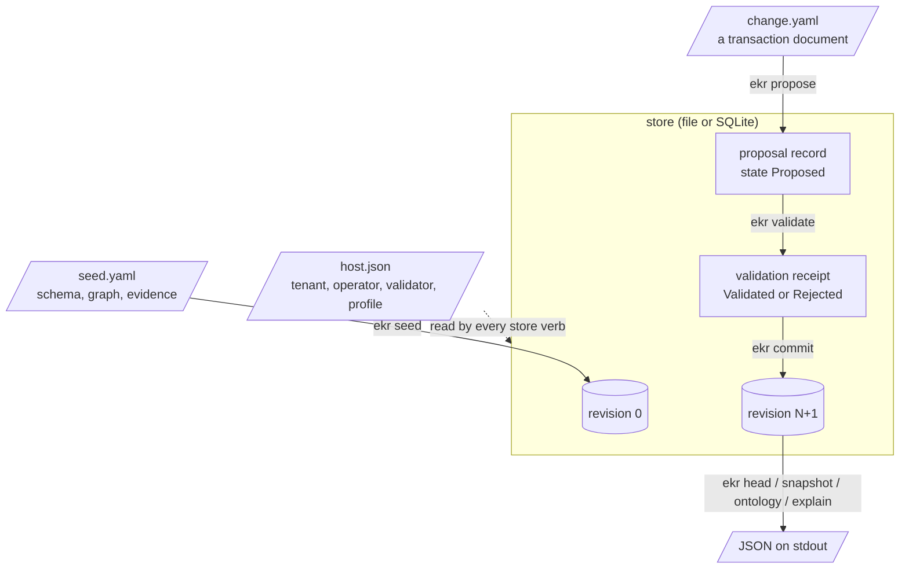
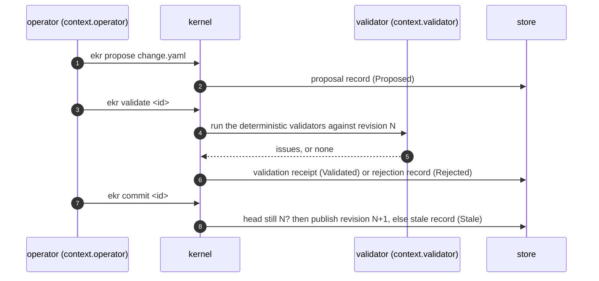
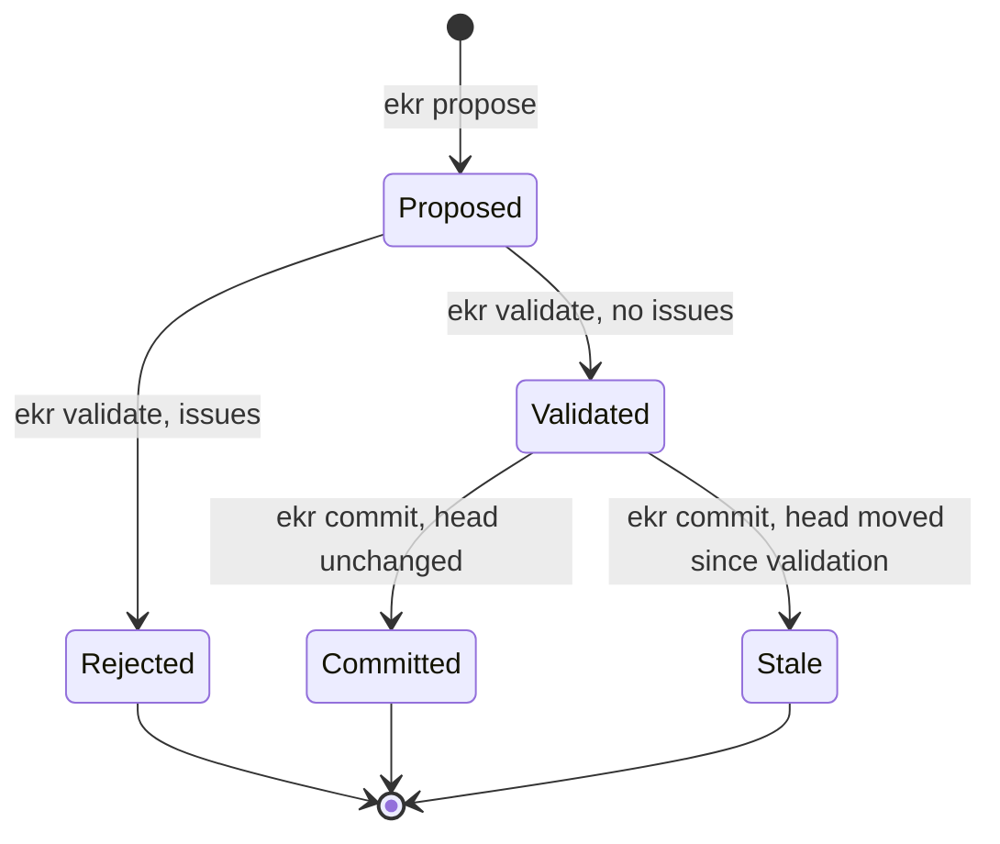
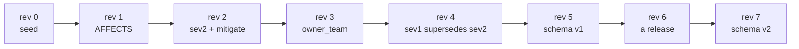
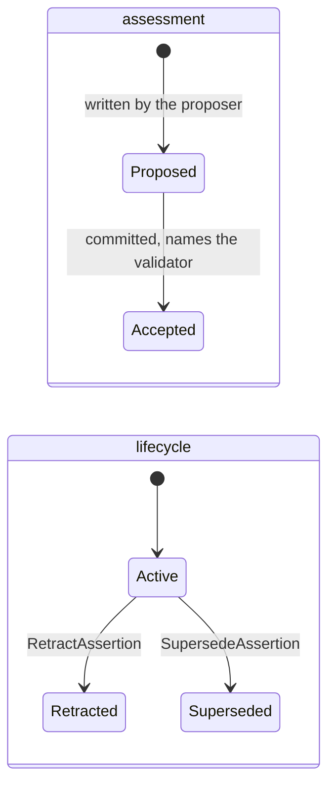
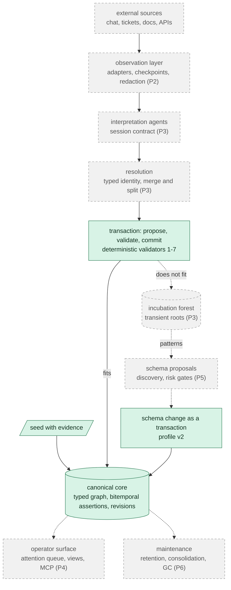
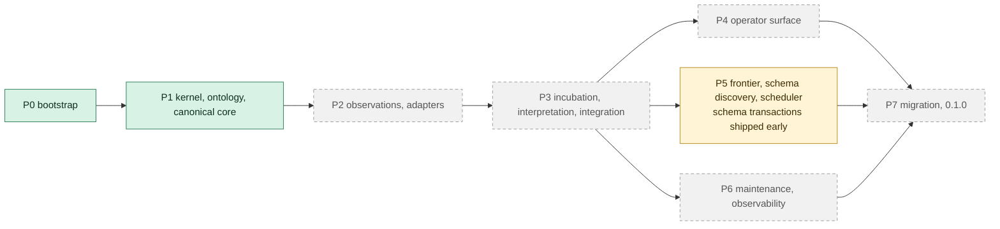

# How EKR works

This page is for a reader who is new to the Epistemic Knowledge Runtime (EKR). It explains what the
runtime keeps, how a change travels from a proposal to a committed revision, and where the project
is going. It then says which parts release 0.0.7 has and which are still plans.

Two pages go further. [The `ekr` guide](guide.md) walks through the same pipeline with a real store,
command by command. [Schema evolution](schema-evolution.md) shows how the schema grows after seeding.
[The CLI reference](cli.md) lists every verb, field and refusal.

## The idea in one paragraph

EKR is a store of typed knowledge in which **nothing is written directly**. You declare a schema
of node types, edge types and properties. You then record knowledge as **assertions**: claims that
each cite the **evidence** they rest on and the **valid time** in which they are true. Every change
is a **transaction** that an operator proposes and a separate validator checks with deterministic
rules. Only a validated transaction is committed, and each commit makes a new immutable
**revision**. You can therefore read any revision back and ask why an assertion holds.

## Vocabulary

| term | what it is | where you meet it |
|---|---|---|
| host document | trusted local configuration: the tenant, the operator id, the validator id and the validation profile | `--host` / `EKR_HOST`, an `ekr.cli-host/1` JSON file |
| store | where revisions live: a directory (file provider) or a database file (SQLite provider) | `--store` / `EKR_STORE`, `--backend` / `EKR_BACKEND` |
| tenant | one knowledge base inside a store. Another tenant is a separate lineage that has not been seeded | `tenant` in the host document |
| seed | revision 0: the first schema version, the initial graph and every evidence payload | `ekr seed`, an `ekr-seed/2` YAML file |
| ontology, schema version | the node types, edge types and properties in force, with a version id, a number and a parent | `ekr ontology [--at N]` |
| node, edge, property | the graph. A property value is a settled attribute and carries no evidence | `ekr snapshot` |
| assertion | a claim with evidence, a valid time, an assessment (`Proposed` then `Accepted`) and a lifecycle (`Active`, `Retracted`, `Superseded`) | `!AddAssertion`, `ekr explain` |
| evidence | where a statement came from, and its exact bytes, addressed by content hash | the seed's `evidence` and `evidence_payloads` |
| transaction | an ordered list of operations, applied all together or not at all | `ekr propose`, an `ekr.transaction-document/2` YAML file |
| revision, root | the committed state after a transaction, and the hashes that address it | `ekr head`, `result` of a commit |

## The pipeline

Each step reads a fixed set of inputs and writes one retained record:

| step | verb | reads | writes to the store | afterwards |
|---|---|---|---|---|
| seed | `ekr seed seed.yaml [--evidence file]…` | the host document, the seed: ontology, graph, evidence entries and payload bytes, pasted or from `--evidence` files | revision 0 with the seed, the evidence payloads and the host's authority. Seeding the same document again writes nothing and returns the original result | `ekr head` prints revision 0 |
| propose | `ekr propose doc.yaml` | the host's operator id, the transaction document's exact bytes | a proposal record, state `Proposed`. The graph does not change | `ekr transactions` lists it |
| validate | `ekr validate <id> [--against N]` | the proposal, the committed revision N (the head by default), its ontology, the retained evidence | a validation receipt (`Validated`) or a rejection record (`Rejected`, with `issues`) | a `Validated` transaction may be committed |
| commit | `ekr commit <id>` | the validation receipt, the current head | a new revision whose parent is the revision validated against, or a stale record (`Stale`) if the head moved | `ekr head` prints the new revision |
| read | `ekr head`, `snapshot`, `ontology`, `explain`, `transactions` | committed revisions and retained records | nothing | |

The operator and the validator are two different agent ids from the host document. The operator
proposes and commits; `ekr validate` runs as the validator. A host document that gives both roles
the same id is refused when the store is opened (`proposer-is-validator`). No verb writes to the
graph without the validator's receipt.

### The transaction lifecycle

A transaction has five states. `Rejected`, `Committed` and `Stale` are final: to try again, propose a
corrected document under a **new** transaction id.

| state | set by | exit code of the verb that set it | what you do next |
|---|---|---|---|
| `Proposed` | `ekr propose` | 0 | `ekr validate <id>` |
| `Validated` | `ekr validate` | 0 | `ekr commit <id>` |
| `Rejected` | `ekr validate` | 0: a rejection is an outcome, read `kind` | fix the document, propose it under a new id |
| `Committed` | `ekr commit` | 0 | read the new revision |
| `Stale` | `ekr commit` | 0: an outcome, read `kind` | propose the same change under a new id and validate it against the new head |

A verb used on the wrong state is refused with `ekr.kernel.TransactionStateConflict`, exit 2. For
example, validating or committing a transaction that is already `Rejected` or `Stale` is refused.
[The guide](guide.md#when-the-head-moves-stale) shows a real stale commit and its retry.

### Revisions and roots

Every revision has a number, a parent and four root hashes. The four roots address the schema, the
graph, the evidence and the authority. A commit changes only the roots of what it changed. In the
guide's store, run with the 0.0.5 binary:

| commit | `ontology_root` | `knowledge_root` | `evidence_root` | `agent_root` |
|---|---|---|---|---|
| revision 0, the seed | set | set | set | set |
| revision 1, an assertion and an edge | same | **new** | same | same |
| revision 5, a schema-only transaction | **new** | same | same | same |

`parent` is the previous revision's root hash, so the revisions form one chain from the seed. The
roadmap's P1 exit evidence is that replaying that chain from the seed reproduces every root. The
store repeats that check each time it opens: each command verifies the whole file-provider log once.

### Two kinds of time

An assertion has a **valid time**, when the claim is true in the world, and a **transaction time**,
when the store recorded it. Pick a revision to choose the transaction time (`snapshot --at N`), and
pick an instant to choose the valid time (`snapshot --valid-at T`). The guide's incident has a
severity claim `sev2` from 09:00 UTC. A later transaction supersedes it with `sev1` from 10:30 UTC.
These three reads come from the same store:

| read | revision | valid at | believed severity |
|---|---|---|---|
| `ekr snapshot --valid-at 1784023200000` | 4 (head) | 10:00 | `sev2` (assertion …0502) |
| `ekr snapshot --valid-at 1784026800000` | 4 (head) | 11:00 | `sev1` (assertion …0503) |
| `ekr snapshot --at 2 --valid-at 1784026800000` | 2 | 11:00 | `sev2`: revision 2 did not yet know about the change |

Supersession closes the old assertion's valid time at the boundary and keeps it; retraction marks
it withdrawn. Neither deletes anything: committed revisions are immutable.

### Asking why

`ekr explain <assertion>` returns the chain behind one assertion, as a list of links, each with a
`kind`. An assertion added by a transaction has `Assertion`, `Proposal`, `Validation`, `Commit` and,
last, one `Evidence` link per cited evidence id. The `Evidence` link carries the retained bytes as
`payload` (base64) and as `text`. An assertion that was later superseded adds a `Lifecycle` link and
then the replacement's own chain. [The guide](guide.md#ask-why-explain) shows both.

## The intended end state

The design document describes a runtime that keeps running. It observes sources, interprets what it
sees, proposes knowledge, validates it and integrates what fits. It **parks** what does not fit in
an incubation forest, and proposes schema changes from the patterns it finds there. It also keeps
itself tidy: it consolidates, decays and forgets. The central sentence of the design is *failure to
integrate is itself information*
([design § 1](epistemic-knowledge-runtime-design.md#1-executive-summary), [§ 25](epistemic-knowledge-runtime-design.md#25-failure-to-integrate-as-information)).

The diagram marks what exists in 0.0.7 (solid, green) and what is planned (dashed, grey).

### What exists in 0.0.7 and what is planned

| capability | design | 0.0.7 | planned in |
|---|---|---|---|
| typed schema: node types, edge types, eleven value kinds, lifecycles and named operations | § 11–12, § 87 | yes, declared in the seed | P1 (done) |
| propose, validate, commit, with the operator and the validator kept apart | § 19–20, § 91 | yes | P1 (done) |
| up to 10,000 operations in 8 MiB in one `ekr.transaction-document/2`; `/1` keeps 256 in 262144 bytes | § 91.3, § 97 | yes, since 0.0.7 | done |
| verbs continue from a replay checkpoint instead of replaying the history; `--full-replay` replays it | § 96 | yes, since 0.0.7 | done |
| deterministic validators: structural, reference, type, cardinality, ontology constraint, provenance, authorization | § 20, validators 1–7 | yes | P1 (done) |
| contradiction, temporal consistency and policy validators | § 20, validators 8–10 | no | with the subsystems that need them |
| bitemporal assertions, retraction, supersession, `snapshot --valid-at`, `explain` | § 13–14, § 36, § 88 | yes | P1 (done) |
| file and SQLite providers, replay from the seed | § 34 | yes | P1 (done) |
| schema changes as transactions: add a node type or an edge type, add or redeclare a property | § 26, § 95 | yes, under validation profile v2, one schema-only transaction at a time | moved ahead of P5 |
| moving a v1 store to v2, mixed schema and data transactions, removing a type or a property | § 95 | no | "a later milestone" (§ 95) |
| evidence in the seed, pasted as byte lists or read from files with `ekr seed --evidence` | § 16 | yes | P1 (done); files since 0.0.6 |
| evidence added after seeding | § 16 | no: evidence enters only through the seed | P2, observations |
| property constraints, operation preconditions, emitted events | § 11, § 87 | declared, but a write touching one is refused (`unsupported-constraint`) | not scheduled in the roadmap |
| `MergeEntity` | § 46 | parses, refused as `unsupported-operation` | P3, merge and split with lineage |
| observations, source adapters, checkpoints, credential redaction | § 15–16, § 54–57 | no | P2 |
| incubation forest, transient roots, interpretation sessions, entity resolution | § 22–28 | no; the one graph root is `Canonical` | P3 |
| attention queue, answers as evidence, approvals for outward writes, rendered views, read-only MCP tools | § 81–84, § 62 | no; `ekr explain` gives the commit-level chain only | P4 |
| frontier, schema discovery from evidence, `SchemaProposal` with risk classes, the unattended loop with a budget | § 30–33, § 50 | no | P5 |
| retention, consolidation, decay, GC, deletion requests, health metrics | § 35–43, § 60–61 | no | P6 |
| importing the two predecessor systems' data | [predecessors](predecessors.md) § 9 | no | P7 |

The phases, the crate map and the exit evidence for each phase are in [the roadmap](roadmap.md).
The crates that exist are `ekr-core`, `ekr-ontology`, `ekr-graph`, `ekr-store`, `ekr-kernel` and the
`ekr` binary. The other crates in roadmap § 3 (`ekr-observe`, `ekr-incubate`, `ekr-views` and the
rest) are not written yet.

## Rules that do not change

These invariants come from [`AGENTS.md`](../AGENTS.md). Each is held by tests, and each is a reason
for something the binary refuses:

- Agents propose; they never mutate. Only the kernel turns a proposal into a committed revision.
- Every canonical assertion cites retained evidence. "An agent said so" is not evidence.
- Names are not identities. Everything has a stable id, which comes from `ekr mint`, `ekr ontology`
  or `ekr snapshot` and is never derived from a name.
- Committed revisions are immutable. A later change is a new revision, a retraction or a supersession.
- Deterministic validators run without a model.
