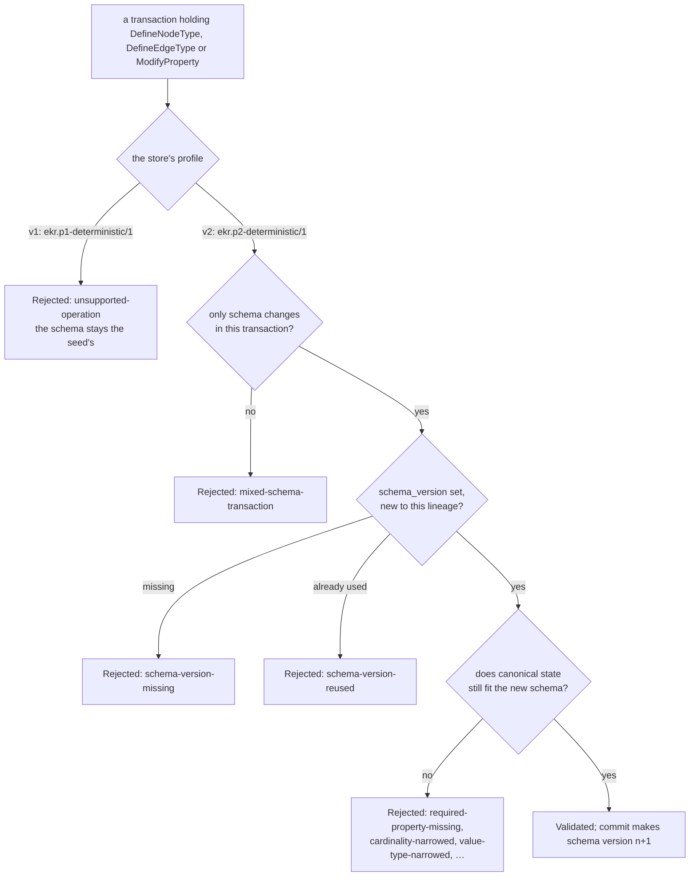
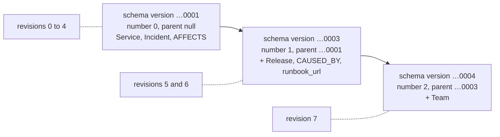

# Schema evolution

A store's schema is not fixed forever. Under **validation profile v2**, a committed transaction can
add a node type, add an edge type, or add or redeclare a property. Each such commit makes a new
**schema version**, numbered one more than the last and naming it as its parent. Nothing already
committed changes. Every earlier revision keeps the schema it was committed under, and
`ekr ontology --at <revision>` prints it.

This page continues [the guide's](guide.md) store, whose head is revision 4. Every file shown is the
file that was run, in this order, with the released `ekr 0.0.5` binary. Outputs are real and trimmed
(`…`). The formal rules are in [design § 95](epistemic-knowledge-runtime-design.md#95-schema-evolution-transactions),
and the field reference is in [the CLI reference](cli.md#evolve-the-schema).
The documents are `ekr.transaction-document/1`, as run; 0.0.7 still reads them, and a new schema
change is written as `ekr.transaction-document/2` (`ekr example schema-change`), which differs only
in its larger [limits](cli.md#document-limits).

## When a schema change is applied



| rule | why | refusal |
|---|---|---|
| the store was seeded under profile v2 | a store keeps the profile its seed recorded; nothing moves a v1 store to v2 | `unsupported-operation` (profile v1) |
| a schema change travels alone | the kernel validates data against one schema version at a time | `mixed-schema-transaction` |
| it names the version it produces, a fresh id | the version id is the new version's identity on the lineage | `schema-version-missing`, `schema-version-reused` |
| no transaction names a version without changing the schema | a version id means a new version | `schema-version-without-schema-change` |
| existing canonical state stays valid under the new schema | a change may not strand a node or an assertion | `required-property-missing`, `cardinality-narrowed`, `value-type-narrowed`, `value-kind-not-admitted`, `constraint-changed` |
| the change has an effect and the result coheres | an unchanged redeclaration or a broken reference is a mistake | `schema-change-without-effect`, `incoherent-schema`, `unknown-property-owner` |

No operation **removes** a type or a property.

## 1. Add a type, an edge type and properties

Incidents are often caused by a release, so the catalogue needs a `Release` type with a required
`version`, and a `CAUSED_BY` edge type from `Incident` to `Release`. While at it, services get an
optional `runbook_url`. Mint the new version's id first:

```shell-session
$ ekr mint schema-version
{
  "id": "01a0dde1-a115-7426-b9ed-54a3fc25d50a",
  "kind": "schema-version"
}
```

This page uses the readable id `…0003` instead. `release-schema.yaml` holds only schema changes.
`ModifyProperty` names its `owner`, the type it changes, which may be a type that an earlier
operation of the same transaction defines:

```yaml
format: ekr.transaction-document/1
transaction:
  id: 00000000-0000-4000-c000-000000000711
  proposer: 00000000-0000-4000-c000-000000000011
  operations:
  - !DefineNodeType
    id: 00000000-0000-4000-c000-000000000104
    name: Release
    parents: []
    properties: {}
    abstract_type: false
    lifecycle: null
    operations: {}
  - !ModifyProperty
    owner: 00000000-0000-4000-c000-000000000104
    property:
      id: 00000000-0000-4000-c000-000000000205
      name: version
      value_type: {value_kind: String}
      cardinality: One
      required: true
      constraints: []
  - !DefineEdgeType
    id: 00000000-0000-4000-c000-000000000105
    name: CAUSED_BY
    source_types: [00000000-0000-4000-c000-000000000102]
    target_types: [00000000-0000-4000-c000-000000000104]
    cardinality: Many
    properties: {}
    inverse: null
    symmetric: false
    transitive: false
  - !ModifyProperty
    owner: 00000000-0000-4000-c000-000000000101
    property:
      id: 00000000-0000-4000-c000-000000000206
      name: runbook_url
      value_type: {value_kind: String}
      cardinality: One
      required: false
      constraints: []
  evidence: []
  schema_version: 00000000-0000-4000-c000-000000000003
```

```shell-session
$ ekr propose release-schema.yaml
  "transaction_id": "00000000-0000-4000-c000-000000000711"
$ ekr validate 00000000-0000-4000-c000-000000000711
  "kind": "Validated"
$ ekr commit 00000000-0000-4000-c000-000000000711
{
  "kind": "Committed",
  "result": {
    "agent_root": "2f078c28d7524d4bcc0c9d1ca3b5b95350e4493e0e38b09a63b2ffa153d6b2ce",
    "evidence_root": "a72fe289497c9d984abc9b0eb41960f74f8bf2afdf967b15d0dd92b2b7ac406b",
    "knowledge_root": "9972020ed2bb6a8bd7dca53f8ad056e9d4f2a33dd5647fce183e3cf3e16fe490",
    "ontology_root": "9199cef4c85c077c607dd3b751caea870a5f18594101246f42f5dd286b3fa055",
    "revision": 5,
    …
  },
  …
}
```

Compare this with revision 4 (`ekr snapshot --at 4`, `root`). Only `ontology_root` moved, from
`4209fcdd…3527` to `9199cef4…a055`. `knowledge_root` is `9972020e…e490` in both, because a schema
change leaves nodes, edges and assertions as they were. The graph root's `schema_version_id` also
stays the seed's `…0001`: it is part of the root's identity. The version in force is read from the
ontology:

```shell-session
$ ekr ontology
{
  "revision": 5,
  "schema_version": "00000000-0000-4000-c000-000000000003",
  "schema_version_number": 1,
  "schema_version_parent": "00000000-0000-4000-c000-000000000001",
  "node_types": [
    {"name": "Service",  "properties": [{"name": "tier", …}, {"name": "owner_team", …}, {"name": "runbook_url", …}], …},
    {"name": "Incident", "properties": [{"name": "severity", …}, {"name": "summary", …}], …},
    {"name": "Release",  "properties": [{"name": "version", "required": true, …}], …}
  ],
  "edge_types": [
    {"name": "AFFECTS",   "source_types": [{"name": "Incident", …}], "target_types": [{"name": "Service", …}], …},
    {"name": "CAUSED_BY", "source_types": [{"name": "Incident", …}], "target_types": [{"name": "Release", …}], …}
  ]
}
```

## 2. Use the new types

Data against the new version is an ordinary transaction, proposed after the schema change has
committed. `release-data.yaml` creates the release, links the incident to it, and resolves the
incident:

```yaml
format: ekr.transaction-document/1
transaction:
  id: 00000000-0000-4000-c000-000000000717
  proposer: 00000000-0000-4000-c000-000000000011
  operations:
  - !CreateNode
    id: 00000000-0000-4000-c000-000000000305
    root_id: 00000000-0000-4000-c000-000000000002
    type_id: 00000000-0000-4000-c000-000000000104
    canonical_name: checkout-api 4.12.0
    properties:
      00000000-0000-4000-c000-000000000205:
      - {value_kind: String, value: 4.12.0}
  - !CreateEdge
    id: 00000000-0000-4000-c000-000000000602
    root_id: 00000000-0000-4000-c000-000000000002
    type_id: 00000000-0000-4000-c000-000000000105
    source: 00000000-0000-4000-c000-000000000303
    target: 00000000-0000-4000-c000-000000000305
    properties: {}
  - !Invoke
    node: 00000000-0000-4000-c000-000000000303
    operation: resolve
    arguments: {}
  evidence: []
```

It validates and commits as revision 6. The schema version is still `…0003`: only a schema change
makes a new one.

## 3. What is refused

Each of these was proposed at revision 6, and `ekr validate` exited 0 with `"kind": "Rejected"`.
The head did not move.

### A schema change mixed with data

`mixed.yaml` defines a `Team` type and creates a team node in the same transaction:

```yaml
format: ekr.transaction-document/1
transaction:
  id: 00000000-0000-4000-c000-000000000712
  proposer: 00000000-0000-4000-c000-000000000011
  operations:
  - !DefineNodeType
    id: 00000000-0000-4000-c000-000000000106
    name: Team
    parents: []
    properties: {}
    abstract_type: false
    lifecycle: null
    operations: {}
  - !CreateNode
    id: 00000000-0000-4000-c000-000000000304
    root_id: 00000000-0000-4000-c000-000000000002
    type_id: 00000000-0000-4000-c000-000000000106
    canonical_name: payments
    properties: {}
  evidence: []
  schema_version: 00000000-0000-4000-c000-000000000004
```

```json
"issues": [
  {"code": "mixed-schema-transaction", "validator": "Structural",
   "message": "1 of the transaction's 2 operations change the schema; a schema change is proposed in a transaction of its own"},
  {"code": "unknown-type", "validator": "Type",
   "message": "node 00000000-0000-4000-c000-000000000304 claims type 00000000-0000-4000-c000-000000000106, which the ontology does not declare"}
]
```

The second issue shows why: the node is checked against the schema in force, which has no `Team`
yet. Commit the type first, then create the node.

### No version, or a used version

`team-no-version.yaml` is the `DefineNodeType Team` alone, without a `schema_version` line.
`team-reused.yaml` is the same with `schema_version: 00000000-0000-4000-c000-000000000001`, the
seed's version:

```json
{"code": "schema-version-missing", "validator": "Structural",
 "message": "the transaction changes the schema and names no schema_version; mint one with `ekr mint schema-version`"}
{"code": "schema-version-reused", "validator": "OntologyConstraint",
 "message": "schema-version-reused: 00000000-0000-4000-c000-000000000001 is already a schema version of this lineage; mint a new one with `ekr mint schema-version`"}
```

### A change the existing state would violate

`severity-required.yaml` makes `severity` required on `Incident`:

```yaml
format: ekr.transaction-document/1
transaction:
  id: 00000000-0000-4000-c000-000000000715
  proposer: 00000000-0000-4000-c000-000000000011
  operations:
  - !ModifyProperty
    owner: 00000000-0000-4000-c000-000000000102
    property:
      id: 00000000-0000-4000-c000-000000000203
      name: severity
      value_type:
        value_kind: Enum
        parameters:
          variants: [sev1, sev2, sev3]
      cardinality: One
      required: true
      constraints: []
  evidence: []
  schema_version: 00000000-0000-4000-c000-000000000005
```

```json
{"code": "required-property-missing", "validator": "OntologyConstraint",
 "message": "required-property-missing: property 00000000-0000-4000-c000-000000000203 is required on 00000000-0000-4000-c000-000000000102, and at least one of its 1 instances carries no value of it"}
```

The incident *has* a severity, but only as an assertion (`…0503`, `sev1`). `required` counts the
node's own property values, and the incident node carries none. An assertion about a property does
not fill that property.

`tier-narrowed.yaml` redeclares `tier` on `Service` with the variants `[critical]` only, which drops
`standard`. The same file otherwise, with transaction `…0716` and version `…0006`:

```json
{"code": "value-type-narrowed", "validator": "OntologyConstraint",
 "message": "value-type-narrowed: property 00000000-0000-4000-c000-000000000201 of 00000000-0000-4000-c000-000000000101 admits less than it did, and instances hold values of it"}
```

`search-api` holds `standard`, so the narrower type would strand it.

### A store under profile v1

The same `release-schema.yaml` in a store seeded from the same `seed.yaml` under a v1 host
(`ekr.p1-deterministic/1` with `ekr.p1-apply/1`):

```shell-session
$ ekr --host host-v1.json --store ./v1-store seed seed.yaml
  "result": {"revision": 0, …}
$ ekr --host host-v1.json --store ./v1-store propose release-schema.yaml
  "transaction_id": "00000000-0000-4000-c000-000000000711"
$ ekr --host host-v1.json --store ./v1-store validate 00000000-0000-4000-c000-000000000711
  "kind": "Rejected",
  "issues": [
    {"code": "unsupported-operation", "message": "DefineNodeType is not supported in P1", "validator": "Structural", …},
    {"code": "unsupported-operation", "message": "ModifyProperty is not supported in P1", "validator": "Structural", …},
    {"code": "unsupported-operation", "message": "DefineEdgeType is not supported in P1", "validator": "Structural", …},
    {"code": "unsupported-operation", "message": "ModifyProperty is not supported in P1", "validator": "Structural", …}
  ]
```

The message says "P1" on purpose. Replay compares every retained rejection's code and message with
what the ruleset says now, so rewording it would stop existing v1 stores from reopening (design § 95).

## 4. A second version, and reading each one back

`team.yaml` is `team-no-version.yaml` with a new transaction id (`…0718`) and
`schema_version: 00000000-0000-4000-c000-000000000004`. That is the id the rejected `mixed.yaml`
named. A rejected transaction does not put its version on the lineage, so the id is still free. It
commits as revision 7.



```shell-session
$ ekr ontology --at 0
  "revision": 0, "schema_version": "00000000-0000-4000-c000-000000000001", "schema_version_number": 0, "schema_version_parent": null
  node types: Service, Incident
$ ekr ontology --at 5
  "revision": 5, "schema_version": "00000000-0000-4000-c000-000000000003", "schema_version_number": 1, "schema_version_parent": "00000000-0000-4000-c000-000000000001"
  node types: Service, Incident, Release
$ ekr ontology --at 7
  "revision": 7, "schema_version": "00000000-0000-4000-c000-000000000004", "schema_version_number": 2, "schema_version_parent": "00000000-0000-4000-c000-000000000003"
  node types: Service, Incident, Release, Team
$ ekr ontology --at 99
ekr: ekr.kernel.RevisionNotFound: revision 99 does not exist
```

The last command exits 2. The `node types` lines are `jq '[.node_types[].name]'` of the same output.

## What is not possible in 0.0.6

| you want to | in 0.0.6 | where it is planned |
|---|---|---|
| change the schema of a store seeded under profile v1 | not possible: seed a new store under v2 | "a later milestone" (design § 95) |
| change the schema and write data in one transaction | refused, `mixed-schema-transaction` | "a later milestone" (design § 95) |
| remove a type or a property | no operation does it | not planned |
| set non-empty property `constraints`, or change them once a type has instances | a write touching a type with constraints is refused (`unsupported-constraint`); changing them on a type with instances is `constraint-changed` | not scheduled |
| have the runtime propose schema changes from evidence, with risk classes and approval gates | not implemented | P5 ([roadmap](roadmap.md)), design § 25–26, § 50 |
